# Benchmarks: how to and some results

## Benchmark a full encoder block

Sweeping over different attention settings to log max memory use and runtime can for instance be done by invoking
`python3 xformers/benchmarks/benchmark_encoder.py`. Specifying a subset to test is done through command line arguments, for instance `python3 xformers/benchmarks/benchmark_encoder.py --causal True --attentions random --activations gelu -fp16 True`.

Please note that:

- These numbers are dependent of hyperparameters (dimensions chosen for Linformer, sparsity of the pattern), they are mostly an illustration
- The sparse attention patterns tested here are just presets, as explained in the linked notebook generating any new sparse attention pattern should be relatively easy, while keeping the benefits of optimized computations.

Some examples, generated with `python3 xformers/benchmarks/benchmark_encoder.py --activations gelu --plot -emb 256 -bs 8 -heads 4`

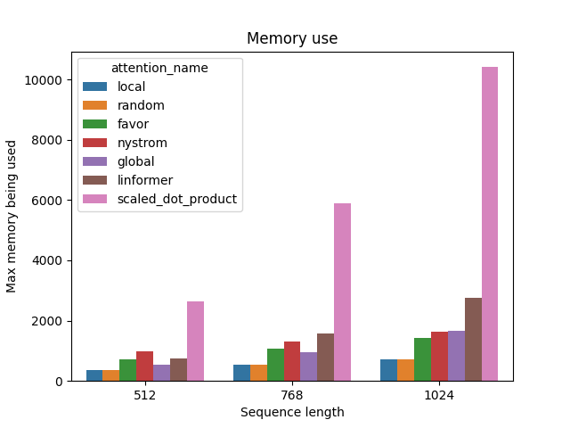  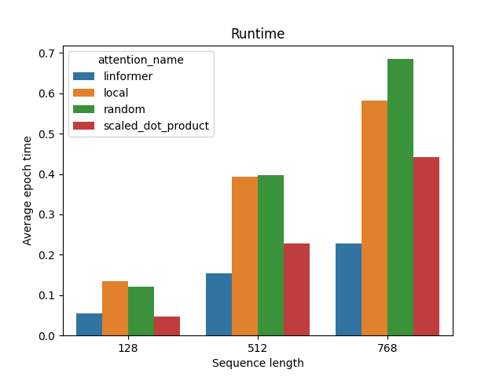

## Benchmark the core sparse attention mechanisms

`python3 xformers/benchmarks/benchmark_core.py` will measure the speed of the core sparse attention mechanism. The current numbers are as follows (times in microseconds (us)):

|                        | **matmul_with_mask**  |                        | **softmax**           |                        | **bmm**               |                        |
| ---------------------- | --------------------- | ---------------------- | --------------------- | ---------------------- | --------------------- | ---------------------- |
|                        | **B=8, M=256, K=128** | **B=8, M=1024, K=256** | **B=8, M=256, K=128** | **B=8, M=1024, K=256** | **B=8, M=256, K=128** | **B=8, M=1024, K=256** |
| dense                  | 62.3                  | 510.3                  | 12.8                  | 141.9                  | 31.0                  | 590.7                  |
| dense with masking     | 84.2                  | 805.3                  | -                     | -                      | -                     | -                      |
| sparsity pytorch: 0.50 | 392.4                 | 6197.4                 | 1140.9                | 8081.4                 | 577.0                 | 13830.2                |
| sparsity pytorch: 0.80 | 336.2                 | 4437.3                 | 515.0                 | 3494.8                 | 254.4                 | 5944.0                 |
| sparsity pytorch: 0.90 | 244.1                 | 3017.4                 | 367.3                 | 1932.6                 | 162.0                 | 3063.0                 |
| sparsity pytorch: 0.95 | 193.2                 | 1899.5                 | 293.6                 | 1078.9                 | 161.6                 | 1692.3                 |
| sparsity pytorch: 0.99 | 195.6                 | 695.0                  | 252.1                 | 342.4                  | 161.9                 | 433.4                  |
| sparsity sputnik: 0.50 | 77.9                  | 1695.9                 | 32.8                  | 164.7                  | 64.6                  | 1640.5                 |
| sparsity sputnik: 0.80 | 43.8                  | 793.0                  | 32.9                  | 50.8                   | 39.6                  | 703.3                  |
| sparsity sputnik: 0.90 | 43.6                  | 435.5                  | 33.0                  | 33.5                   | 39.6                  | 391.4                  |
| sparsity sputnik: 0.95 | 43.2                  | 258.6                  | 32.5                  | 32.7                   | 39.7                  | 223.6                  |
| sparsity sputnik: 0.99 | 43.5                  | 145.4                  | 33.2                  | 32.7                   | 39.7                  | 77.4                   |

## Triton layers

Please not that as of November 2022 these layers are not optimized for typical production GPUs out there (not developed for some time and mostly tested on a laptop GPU), and that better performances are probably possible with some minor changes as proven in other libraries since xformers went out.

### Fused softmax

You can reproduce these numbers locally by running `python3 xformers/benchmarks/benchmark_triton_softmax.py`. The units are GB/s. These results are for a laptop nVidia 3080, Triton 2.0 and PyTorch 1.12.

### Fused linear layer

You can reproduce these numbers locally by running `python3 xformers/benchmarks/benchmark_triton_fused_linear_layer.py`. The units are TFlops/s. These results are for a laptop nVidia 3080, Triton 2.0 and PyTorch 1.12.

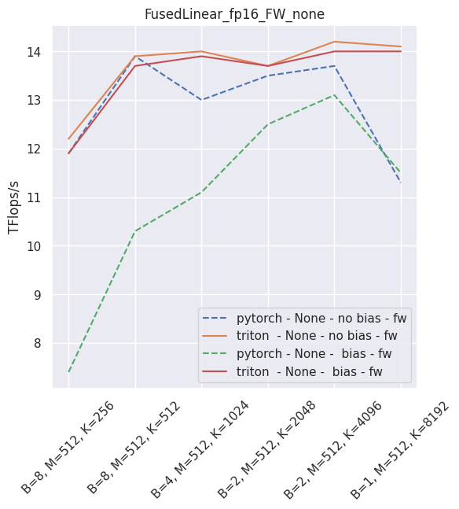

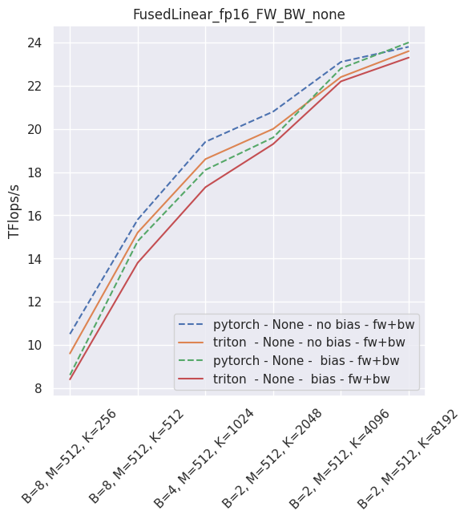

### Fused layer norm

You can reproduce these numbers locally by running `python3 xformers/benchmarks/benchmark_triton_layernorm.py`. The units are GB/s. These results are for a laptop nVidia 3080, Triton 2.0 and PyTorch 1.12.

)

)

)

### Fused dropout + bias + activation

You can reproduce these numbers locally by running `python3 xformers/benchmarks/benchmark_triton_dropout.py`. The units are GB/s. These results are for a laptop nVidia 3080, Triton 2.0 and PyTorch 1.12.

)

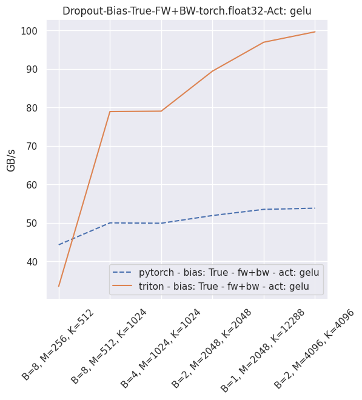)

)

)

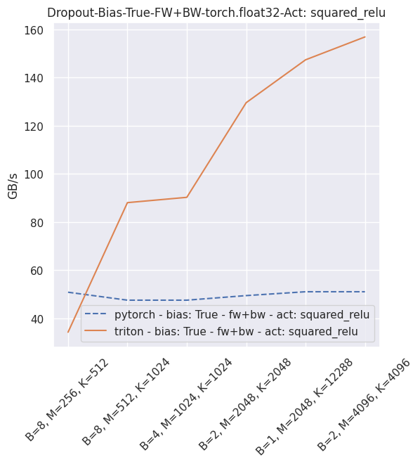)

)

## LRA

The code for this benchmark has been adapted from [this repository](https://github.com/mlpen/Nystromformer/tree/main/LRA). [A dedicated README is available here](xformers/benchmarks/LRA/README.md)

__Some results:__

| Attention                   | ListOps  | Text      | Retrieval | Image     | Pathfinder | *Avg*     | *Est. Gflops* | *Peak mem (mb)* |
| --------------------------- | -------- | --------- | --------- | --------- | ---------- | --------- | ------------- | --------------- |
| _Chance_                    | _10_     | _50_      | _50_      | _10_      | _50_       | _34_      | _0_           | _0_             |
| Standard                    | **37.5** | 62.66     | 79.24     | 38.69     | **70.37**  | **57.69** | 1.21          | 2291            |
| Nystromformer-128           | 36.29    | 63.24     | 78.18     | **42.86** | 67.49      | 57.61     | 0.62          | 383             |
| Favor-256 (redraw)          | 19.56    | 62.76     | **81.1**  | 36.09     | 67.23      | 53.35     | 0.49          | 445             |
| FourierMix                  | 36.29    | 60.72     | 76.41     | 36.53     | 54.07      | 52.8      | **0.17**      | **87**          |
| Linformer-seq/4 (no redraw) | 36.69    | 57.39     | 76.41     | 35.57     | 65.12      | 54.2      | 0.67          | 719             |
| Lambda                      | 19.76    | 62.47     | 79.11     | 35.04     | 49.74      | 49.224    | x             | 1023            |
| Orthoformer-32              | 27.42    | **63.96** | 77.96     | 34.5      | 67.11      | 54.19     | 0.187         | 155             |

- Contrary to the initial LRA proposal, __we use the same model architecture for all tasks (2 layers).__
- The training schedule for ListOps has been lengthened, while keeping it the fastest of all tasks, which reduces the seed dependence in the final accuracy figure.
- Estimated flops and peak memory are on the ListOps task, using 4 GPUs. Note that LRA is not completely well defined, in that hyperparameters and model architectures can vary (should the same architecture be used everywhere ? Similar hyperparams ?). This could be improved in the future, but in the meantime one should probably not read too much into small differences for some tasks, probably not meaningful.

_Note_: The estimated flops currently miss accounting for many operators, and are almost certainly an undercount. See issue [#154](https://github.com/fairinternal/xformers/issues/154)

## Causal Attention Blocksparse Optimization

FP16            | FP32
:-------------------------:|:-------------------------:
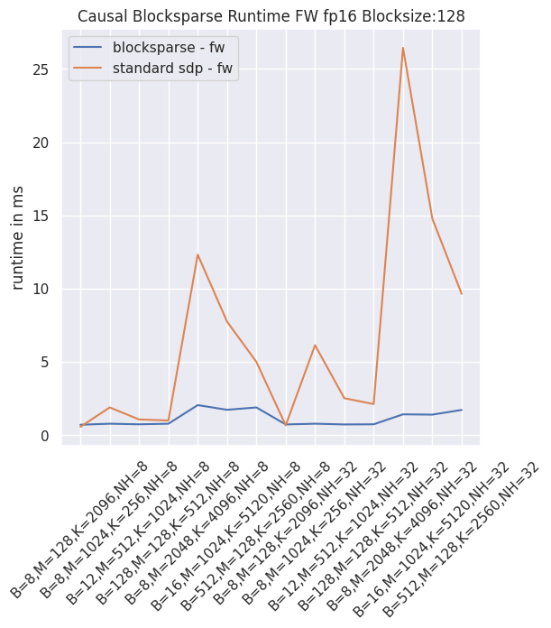  |  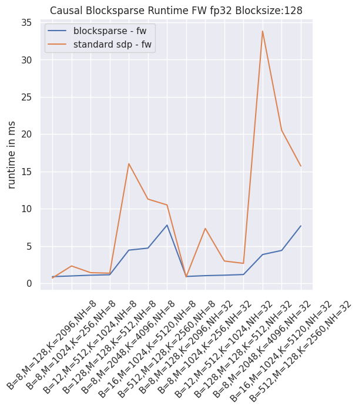
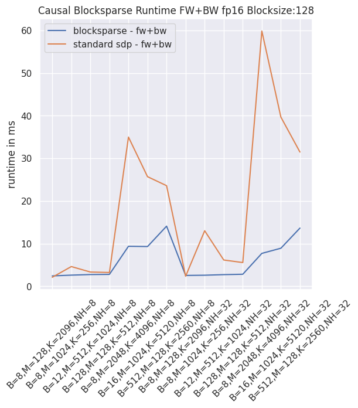  |  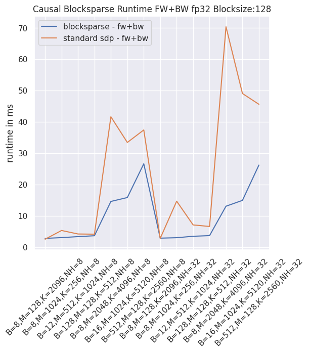
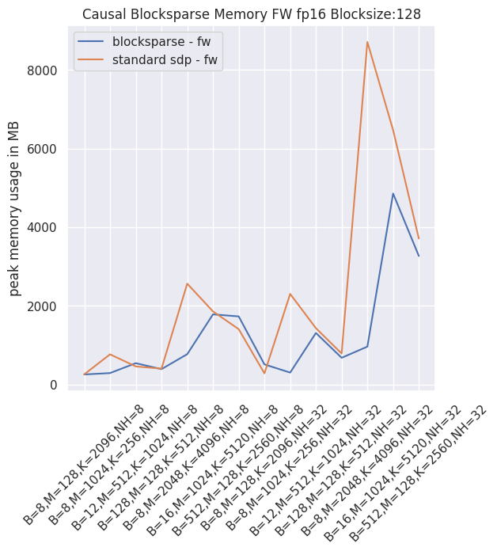  |  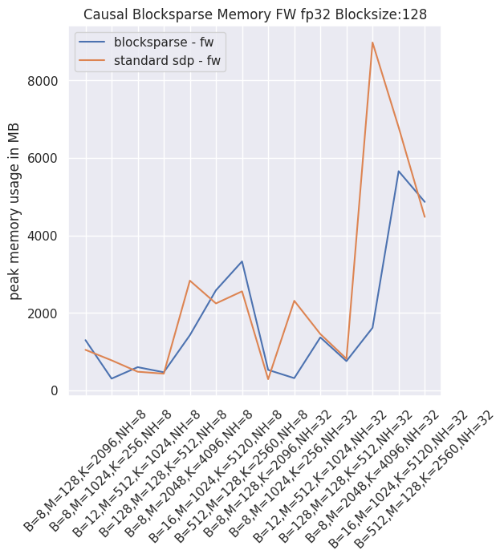
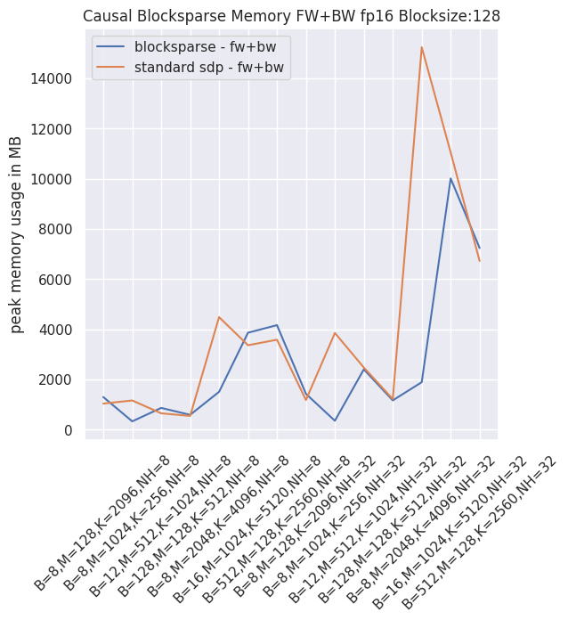  |  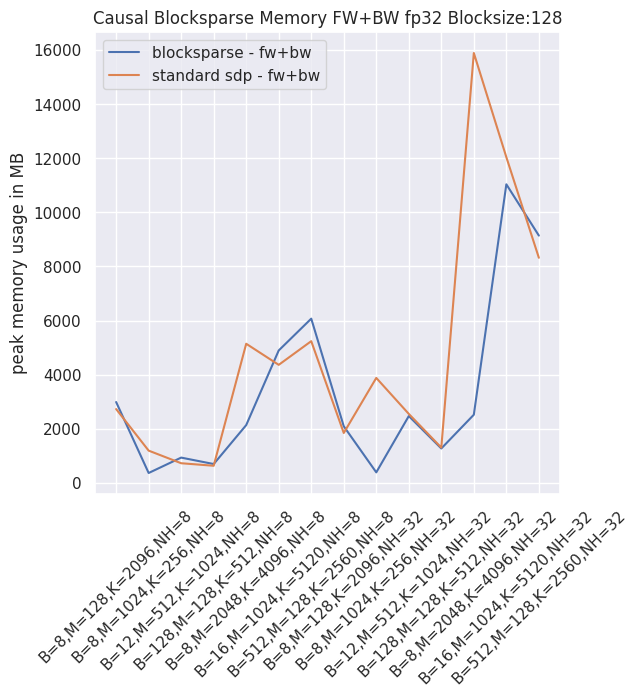
