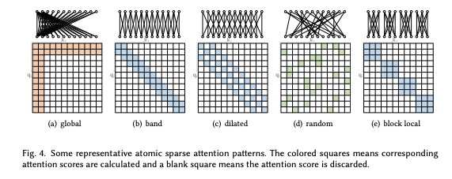
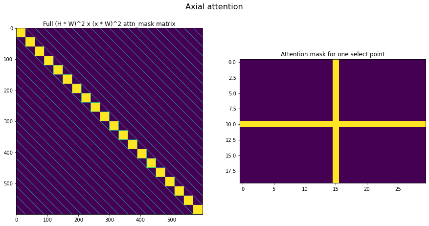
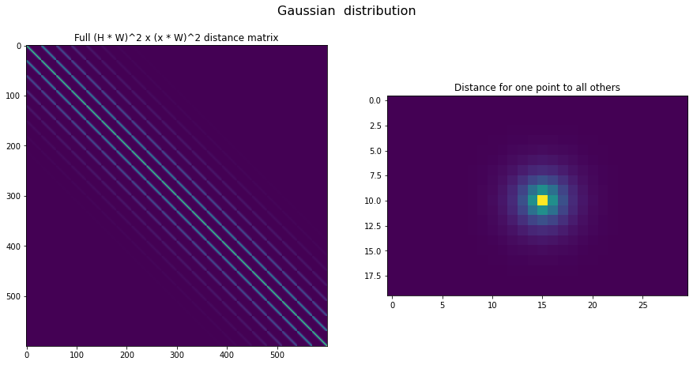
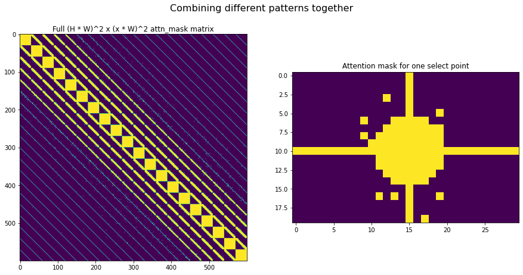

# HOW TO ?

Let's present here a couple of code snippets on how to solve a couple of questions that you may have. This is a living document, feel free to edit and complete it with any missing parts.

- [HOW TO ?](#how-to-)
  - [Understanding the dimension conventions](#understanding-the-dimension-conventions)
    - [Batch dimensions](#batch-dimensions)
    - [Attention masks](#attention-masks)
  - [Sparse Attention](#sparse-attention)
    - [How to use it ?](#how-to-use-it-)
    - [Create complex sparsity patterns with xFormers](#create-complex-sparsity-patterns-with-xformers)
    - [Replace all attentions from an existing ViT model with a sparse equivalent ?](#replace-all-attentions-from-an-existing-vit-model-with-a-sparse-equivalent-)
    - [Some more examples](#some-more-examples)
  - [BlockSparseAttention](#blocksparseattention)
  - [From cherry picking attentions to building whole models](#from-cherry-picking-attentions-to-building-whole-models)
    - [Testing out an attention mechanism](#testing-out-an-attention-mechanism)
    - [Building an encoder, comparing to PyTorch](#building-an-encoder-comparing-to-pytorch)
      - [PyTorch Encoder Layer](#pytorch-encoder-layer)
      - [Warning](#warning)
      - [Block factory](#block-factory)
    - [Fair enough, now I just want to build models and be done with it](#fair-enough-now-i-just-want-to-build-models-and-be-done-with-it)
      - [PyTorch Transformer](#pytorch-transformer)
      - [model factory](#model-factory)
      - [practical usecase: microGPT](#practical-usecase-microgpt)
      - [another practical usecase: microViT](#another-practical-usecase-microvit)
  - [Extensibility](#extensibility)
    - [Extend the xFormers parts zoo locally](#extend-the-xformers-parts-zoo-locally)
    - [Contributing an extension to the xFormers repository](#contributing-an-extension-to-the-xformers-repository)
  - [Reversible block](#reversible-block)
    - [Intro](#intro)
    - [Transformer](#transformer)
    - [In practice](#in-practice)
    - [Hierarchical Transformers](#hierarchical-transformers)


## Understanding the dimension conventions

Let's start from a classical overview of the Transformer architecture (illustration from Lin et al,, "A Survey of Transformers")


You should be able to match most of the blocks to parts exposed in `xformers/components`. In particular, the attention is handled through two parts: the `MultiHeadDispatch`, which is shared across most attention mechanisms, and the proper attention (in `xformers/components/attention`) which you can see as being head-ignorant (except for a couple of attention mechanisms).

### Batch dimensions

The dimensions expectations are, throughout the Transformer pipeline:

- inputs:
  - **`[Batch, Sequence]`**
  - (note that a model like ViT would have a different front end which additionally handle the image channels)

- post-encoding:
  - **`[Batch, Sequence, Embedding]`**

  the following sequence repeats for every Transformer layer after the initial encoding:
  - multi-head wrapper:
    - reshapes to **`[Batch * n_heads, Sequence, head_dimension]`**
    - compute per-head attention
    - reshapes outputs back to **`[Batch, Sequence, Embedding]`**
  - FFN:
    - **`[Batch, Sequence, Embedding]`**
    - keeps the same dimensions all along

### Attention masks

1. Sparse attention: In that case, the attention mask is expected to be **`[Sequence, Sequence]`**, no need to expand or repeat it across the batch for instance.

2. Blocksparse attention: two options are equaly valid in that case,  **`[Sequence, Sequence]`** or  **`[Head, Sequence, Sequence]`**. Attention masks can be defined on a per-head basis

The following patterns are for instance possible (from "A survey of Transformers", Lin et al.)



Many helpers to generate 2d and 3d patterns are [available](xformers/components/attention/attention_patterns.py), as well as a small tool to get a blocksparse pattern out of an existing per-coeffient mask.

## Sparse Attention

### How to use it ?

There is nothing specific to be done, as long as you are using the normal `scaled_dot_product` attention ! As soon as it is called with a sparse enough mask (`density < 30%`), then the computations will be sparse.

```python
import torch
from xformers.components.attention import ScaledDotProduct

attention = ScaledDotProduct().cuda()

# FW a random bunch of data
inputs = torch.rand((16, 1024, 1024), device=torch.device("cuda"))

# Not a very sparse mask to begin with
torch.cuda.empty_cache()
torch.cuda.reset_peak_memory_stats()

mask = (torch.rand((1024, 1024)) < 0.9).cuda()
att = attention(q=inputs, k=inputs, v=inputs, mask=mask)

torch.cuda.synchronize()
max_memory = torch.cuda.max_memory_allocated() // 2 ** 20
print(f"Dense - Peak memory use: {max_memory}MB")

# Now use a very sparse mask and observe that memory use changes
torch.cuda.empty_cache()
torch.cuda.reset_peak_memory_stats()

mask = (torch.rand((1024, 1024)) < 0.1).cuda()
att = attention(q=inputs, k=inputs, v=inputs, mask=mask)

torch.cuda.synchronize()
max_memory = torch.cuda.max_memory_allocated() // 2 ** 20
print(f"Sparse - Peak memory use: {max_memory}MB")
```

You should see something along the lines of:

```bash
Dense - Peak memory use: 501MB
Sparse - Peak memory use: 321MB
```

Note that we did not change anything in the model, the input mask was just sparse enough to trigger the specific CUDA kernels.

### Create complex sparsity patterns with xFormers

This is best presented in an executable notebook, see [Creating complex sparsity patterns with xFormers](docs/source/2d_attention_patterns.ipynb). We can expose a couple of concepts here, though. Attention patterns are expressed over the attention matrix, and they intuitively represent the fact that an element in a sequence is allowed to "look at" another element in another sequence (same sequence in the self-attention case). With this framework, a local attention (an element is only able to look at its neighbors) is simply a diagonal pattern, while an element which can look at the whole sequence has a row+col matching mask. xFormers provide a couple of helpers to generate attention patterns, which can then be combined:

```python
import xformers.components.attention.attention_patterns as AP

# Couple of examples of attention patterns useful for vision
H, W = 20, 30  # assuming a 20 x 30 sequence length

# - axial attention
axial_pattern = AP.axial_2d_pattern(H, W)

# - local attention
loc_2d_dist = AP.local_2d_pattern(H, W, distance=5, p=2.0)  # distance and thresholds are user defined

# - random attention
gaus_2d_dist = AP.local_2d_gausian_distribution(H, W, sigma=2)
sparsity = 0.95
num_non_zeros = int((H * W) ** 2 * (1 - sparsity))
random_gaus_2d_pattern = AP.random_pattern_from_probability_matrix(gaus_2d_dist, num_non_zeros)

# - combining different patterns
combined_mask = axial_pattern | loc_2d_dist | random_gaus_2d_pattern
```






### Replace all attentions from an existing ViT model with a sparse equivalent ?

Let's say you're used to working with a given Transformer based model, and want to experiment with one of the attention mechanisms supported by xFormers. We have [notebooks](docs/source/vision_transformers.ipynb) for a more exhaustive take, if this snippet exposes any doubt please check out the notebook to make sure that everything is clear, or just reach out to the authors.

```python
import timm
from timm.models.vision_transformer import VisionTransformer
from xformers.components.attention import ScaledDotProduct
from xformers.helpers.timm_sparse_attention import TimmSparseAttention
img_size = 224
patch_size = 16

# Get a reference ViT model
model = VisionTransformer(img_size=img_size, patch_size=patch_size,
                              embed_dim=96, depth=8, num_heads=8, mlp_ratio=3.,
                              qkv_bias=False, norm_layer=nn.LayerNorm).cuda()


# Define the mask that we want to use
# We suppose in this snippert that you have a precise mask in mind already
# but several helpers and examples are proposed in  `xformers.components.attention.attention_patterns`
my_fancy_mask : torch.Tensor  # This would be for you to define

# Define a recursive monkey patching function
def replace_attn_with_xformers_one(module, att_mask):
    module_output = module
    if isinstance(module, timm.models.vision_transformer.Attention):
        qkv = module.qkv
        dim = qkv.weight.shape[1] * module.num_heads
        # Extra parameters can be exposed in TimmSparseAttention, this is a minimal example
        module_output = TimmSparseAttention(dim, module.num_heads, attn_mask=att_mask)
    for name, child in module.named_children():
        module_output.add_module(name, replace_attn_with_xformers_one(child, att_mask))
    del module

    return module_output

# Now we can just patch our reference model, and get a sparse-aware variation
model = replace_attn_with_xformers_one(model, mask)
```

Note that in practice exchanging all the attentions with a sparse alternative may not be a good idea, as the attentions closer to the output are not typically exhibiting a clear sparsity pattern. You can alter `replace_attn_with_xformers_one` above, or replace manually the attentions which would like to sparsify, but not all

### Some more examples

- on [changing ViT to use sparse attention and benchmarking the effects](docs/source/vision_transformers.ipynb)
- on creating [complex sparsity patterns](docs/source/2d_attention_patterns.ipynb)
- on a [SwinTransformers](docs/source/swin_transformers.ipynb)

## BlockSparseAttention

BlockSparse attention uses [Triton](https://github.com/openai/triton) to limit the attention computations to some tiles, which you define at construction time.
A simple example is that of a causal attention: just compute the lower triangular tiles ! The tile size can be changed, the minimum being 16 coefficients on one dimension.

If you already have a per-coefficient pattern in mind and this is not a perfect match with a block pattern, this is probably fine,
BlockSparse is fast enough so that dropping some of the computations after the fact with a fine-grained mask is still probably better than dense computations.

We provide a small helper (this is just maxpooling) to convert in between a per coefficient binary mask and the layout that you will need to build a block sparse attention. Please note that for now _blocksparse attention requires the sequence length to be a power of two_.

Let's look at an example:

```python
import torch

from xformers.components import MultiHeadDispatch
from xformers.components.attention import BlockSparseAttention

BATCH = 2
HEADS = 8
SEQ = 2048
EMB = 1024
BLOCK_SIZE = 32
DROPOUT = 0.1
dtype = torch.float16

# Let's try out a causal mask, but really it could be anything "block sparse enough"
causal_mask = torch.tril(torch.ones((SEQ, SEQ), device=torch.device("cuda"), dtype=dtype))

blocks = SEQ // BLOCK_SIZE
causal_layout = torch.tril(torch.ones([HEADS, blocks, blocks]))

# Let's build our blocksparse attention. Please note that the layout can be
# [SEQ//BLOCK_SIZE, SEQ//BLOCK_SIZE] or  [HEADS, SEQ//BLOCK_SIZE, SEQ//BLOCK_SIZE]
# so that _you can pass a different layout per head_
attention = BlockSparseAttention(layout=causal_layout, block_size=BLOCK_SIZE, dropout=DROPOUT, num_heads=HEADS)

# Out of commodity, let's build our multihead attention now
# "multi_head" will be responsible for the forward
multi_head = (
    MultiHeadDispatch(
        dim_model=EMB,
        residual_dropout=DROPOUT,
        num_heads=HEADS,
        attention=attention,
    )
    .cuda()
    .half()
)

# Now FW some random data
# Note that passing a per-coefficient mask makes it possible to remove extra coefficients,
# which where required by the blockification
query = torch.randn((BATCH, SEQ, EMB), requires_grad=True, device=torch.device("cuda"), dtype=dtype)

# Self attention in this particular example, no limitations really
att_val = multi_head(query=query, key=query, value=query, att_mask=causal_mask)

#########################################
# Bonus: compare the memory use vs dense:
def mem_use(fn, kwargs, title):
    # bookeeping
    import time

    start = time.time()
    torch.cuda.empty_cache()
    torch.cuda.reset_peak_memory_stats()

    # actually run the function
    fn(**kwargs)
    torch.cuda.synchronize()
    stop = time.time()

    # now report
    max_memory = torch.cuda.max_memory_allocated() // 2 ** 20
    print(f"{title} - Peak memory use: {max_memory}MB - {round((stop-start)*1e6)/1e3}ms")


pytorch_multihead = torch.nn.MultiheadAttention(
    EMB, HEADS, batch_first=True, device=torch.device("cuda"), dtype=torch.float16
)

mem_use(multi_head, {"query": query, "key": query, "value": query, "att_mask": causal_mask}, "Blocksparse")
mem_use(pytorch_multihead, {"query": query, "key": query, "value": query, "attn_mask": causal_mask}, "PyTorch")
```

On a V100, with PyTorch 1.9, Triton 1.1 and xFormers 0.0.2 this reports something along the lines of:

```bash
    Blocksparse - Peak memory use: 151MB - 6.619ms
    PyTorch - Peak memory use: 393MB - 6.837ms
```

Note that the pattern here is not that sparse (half of the matrix is empty), the more sparse it gets the more biased the result will get towards BlockSparseAttention.

## From cherry picking attentions to building whole models

### Testing out an attention mechanism

There are two paths to do this:

- Either you import the attention mechanisms that you're interested in directly in your code base, their API should be very similar and you would own everything. The dimension expectations are explained in [Understand the dimension conventions](#understand-the-dimension-conventions).

```python
import torch
from xformers.components.attention import ScaledDotProduct

attention = ScaledDotProduct().cuda()
inputs = torch.rand((16, 1024, 1024), device=torch.device("cuda"))
mask = (torch.rand((1024, 1024)) < 0.9).cuda()
self_attention = attention(q=inputs, k=inputs, v=inputs, mask=mask)
```

Any of the other attention mechanisms can be instantiated and called in a similar way.

- Alternatively, a `build_attention` helper is provided, which takes a dict as an input. In that case, you defer a lot of the instantiation work to xFormers, which makes it a little more obscure although the parameters are hopefully straightforward. This was initially built for internal use in xFormers, to make sure that we can programatically build and test all possible combinations. In turn this should allow you to do sweeps or architecture search, given that the multihead attention definition becomes something like:

```python
from xformers.components import MultiHeadDispatch, build_attention
SEQ = 1024
MODEL = 384
HEADS = 16
DROPOUT = 0.1

my_config = {
    "name": attention_name,  # you can easily make this dependent on a file, sweep,..
    "dropout": DROPOUT,
    "seq_len": SEQ,
    # add any extra parameter that this specific attention would require
    # this can be a superset of all the parameters if you're sweeping, useless parameters will be ignored
}

attention = build_attention(my_config)

# build a multi head dispatch to test this attention mechanism
multi_head = MultiHeadDispatch(
    seq_len=SEQ,
    dim_model=MODEL,
    residual_dropout=DROPOUT,
    num_heads=HEADS,
    attention=attention,
).to(device)

# do something with my new multi-head attention
#...
```

Please note that this approach is not restricted to the attention, you can always import directly and work with `xformers.components.MultiHeadDispatch`, or `xformers.components.feedforward.FusedMLP`, or even `xformers.factory.xFormerEncoderBlock`.

Something else of note is that, __while most attentions in xFormers will support a `causal` flag, one would really benefit from a pure causal computation (ie: only working on the lower triangular attention matrix) with the Sparse and BlockSparse attention if using a matching lower triangular pattern__. xFormers will possibly automate this in the future.

### Building an encoder, comparing to PyTorch

Let's now walk up the hierarchy, and consider a whole encoder block. You may be used to the PyTorch encoder layer so we'll consider it as a point of comparison, but other libraries would probably expose similar interfaces.

#### PyTorch Encoder Layer

PyTorch already exposes a [TransformerEncoderLayer](https://pytorch.org/docs/stable/generated/torch.nn.TransformerEncoderLayer.html?highlight=encoder#torch.nn.TransformerEncoderLayer). Its constructor is:

```python
TransformerEncoderLayer(
    d_model,
    nhead,
    dim_feedforward=2048,
    dropout=0.1,
    activation='relu',
    layer_norm_eps=1e-05,
    batch_first=False,
    device=None,
    dtype=None
    ):
    ...
```

Note that you cannot change the attention mechanism, so this example will use the "Scaled Dot Product", as proposed by Vaswani et al., but in the xFormers case this is a free floating parameter.

#### Warning

It’s worth noting that **xFormer’s blocks expect tensors to be batch first, while PyTorch’s transformers uses a sequence first convention. Don’t forget to permute if you use xFormers’s blocks as drop-in replacements.**

Similarly, the attention masks conventions are different: in PyTorch, the mask is *True* when an element should *not* be attended to, whereas in xFormer it’s the opposite. Don’t forget to negate your attention masks to use xFormers’ blocks as drop-in replacements.

#### Block factory

We don't have the exact same interfaces, but we have something fairly close to PyTorch with the [model_factory](xformers/factory/model_factory.py). Please note that, similarly to the attention example above, you can also directly import the `xFormerEncoderBlock` and construct it from there, but we'll assume here that you could be interested in systematic evaluation of different architectures, and that as such something which can be easily automated is preferred, so the "factory" path is the one put forward.

The equivalent to the PyTorch example above would look like the following. You can think of it  as a declaration of the sequence of blocks that you would like instantiated. We're trying to:

- make it very explicit what is in this block
- keep everything pythonic
- make this sweep and automation friendly in general

With this said, you can build an encoder directly as follows:

```python
from xformers.factory import xFormerEncoderBlock, xFormerEncoderConfig
import torch

BATCH = 8
SEQ = 1024
EMB = 384
VOCAB = 64

encoder_config = {
    "dim_model": EMB,
    "residual_norm_style": "pre",  # Optional, pre/post
    "position_encoding_config": {
        "name": "vocab",  # whatever position encodinhg makes sense
        "seq_len": SEQ,
        "vocab_size": VOCAB,
    },
    "multi_head_config": {
        "num_heads": 4,
        "residual_dropout": 0,
        "attention": {
            "name": "linformer",  # whatever attention mechanism
            "dropout": 0,
            "seq_len": SEQ,
        },
    },
    "feedforward_config": {
        "name": "MLP",
        "dropout": 0,
        "activation": "relu",
        "hidden_layer_multiplier": 4,
    },
}

# "constructing" the config will lead to a lot of type checking,
# which could catch some errors early on
config = xFormerEncoderConfig(**encoder_config)

encoder = xFormerEncoderBlock(config)

#  Test out with dummy inputs
x = (torch.rand((BATCH, SEQ)) * VOCAB).abs().to(torch.int)
y = encoder(x, x, x)
print(y)
```

### Fair enough, now I just want to build models and be done with it

This is the last example in the series, and goes one level up again, so that we consider building a whole Tranformer/xFormer model. Please note that this is just an example, because building the whole model from explicit parts is always an option, from pure PyTorch building blocks or adding some xFormers primitives.

#### PyTorch Transformer

Am implementation of a full Transformer is supported directly by PyTorch, see the [doc](https://pytorch.org/docs/stable/generated/torch.nn.Transformer.html?highlight=transformer#torch.nn.Transformer) for more options.

```python
Transformer(
    d_model=512,
    nhead=8,
    num_encoder_layers=6,
    num_decoder_layers=6,
    dim_feedforward=2048,
    dropout=0.1,
    activation='relu',
    custom_encoder=None, # the xFormers example below defines that
    custom_decoder=None, # Same
    layer_norm_eps=1e-05,
    batch_first=False,
    device=None,
    dtype=None):
        .
```

#### model factory

We don't have the exact same interfaces, but we have something to propose with the [model_factory](xformers/factory/model_factory.py). Please note that, similarly to the attention example above, you can also directly import the `xFormer` and ``xFormerConfig` and construct it from there, but we'll assume here that you could be interested in systematic evaluation of different architectures, and that as such something which can be easily automated is preferred, so the "factory" path is the one put forward.

The equivalent to the PyTorch example above would look like the following. You can think of it  as a declaration of the sequence of blocks that you would like instantiated. This is not really apples to apples, because we define a custom encoder and decoder here. There's also an added flexibility with xFormers in that attention mechanisms can be chosen at will, on a per-layer basis.

```python
from xformers.factory.model_factory import xFormer, xFormerConfig
import torch

EMB = 384
SEQ = 1024
BATCH = 16
VOCAB = 64

my_config = [
    # A list of the encoder or decoder blocks which constitute the Transformer.
    # Note that a sequence of different encoder blocks can be used, same for decoders
    {
        "reversible": False,  # Optionally make these layers reversible, to save memory
        "block_type": "encoder",
        "num_layers": 3,  # Optional, this means that this config will repeat N times
        "dim_model": EMB,
        "residual_norm_style": "pre",  # Optional, pre/post
        "position_encoding_config": {
            "name": "vocab",  # whatever position encodinhg makes sense
            "seq_len": 1024,
            "vocab_size": VOCAB,
        },
        "multi_head_config": {
            "num_heads": 4,
            "residual_dropout": 0,
            "attention": {
                "name": "linformer",  # whatever attention mechanism
                "dropout": 0,
                "causal": False,
                "seq_len": SEQ,
            },
        },
        "feedforward_config": {
            "name": "MLP",
            "dropout": 0,
            "activation": "relu",
            "hidden_layer_multiplier": 4,
        },
        # Optional Simplicial Embeddings on the last encoder layer
        # the temperature parameter is itself optional
        "simplicial_embeddings": {"L": 4, "temperature": 0.5}
    },
    {
        "reversible": False,  # Optionally make these layers reversible, to save memory
        "block_type": "decoder",
        "num_layers": 3,  # Optional, this means that this config will repeat N times
        "dim_model": EMB,
        "residual_norm_style": "pre",  # Optional, pre/post
        "position_encoding_config": {
            "name": "vocab",  # whatever position encodinhg makes sense
            "seq_len": SEQ,
            "vocab_size": VOCAB,
        },
        "multi_head_config_masked": {
            "num_heads": 4,
            "residual_dropout": 0,
            "attention": {
                "name": "nystrom",  # whatever attention mechanism
                "dropout": 0,
                "causal": True,
                "seq_len": SEQ,
            },
        },
        "multi_head_config_cross": {
            "num_heads": 4,
            "residual_dropout": 0,
            "attention": {
                "name": "favor",  # whatever attention mechanism
                "dropout": 0,
                "causal": True,
                "seq_len": SEQ,
            },
        },
        "feedforward_config": {
            "name": "MLP",
            "dropout": 0,
            "activation": "relu",
            "hidden_layer_multiplier": 4,
        },
    },
]

# This part of xFormers is entirely type checked and needs a config object,
# could be changed in the future
config = xFormerConfig(my_config)
model = xFormer.from_config(config)

#  Test out with dummy inputs
x = (torch.rand((BATCH, SEQ)) * VOCAB).abs().to(torch.int)
y = model(src=x, tgt=x)
print(y)
```

Note that this exposes quite a few more knobs than the PyTorch Transformer interface, but in turn is probably a little more flexible. There are a couple of repeated settings here (dimensions mostly), this is taken care of in the [LRA benchmarking config](benchmarks/LRA/code/config.json)

You can compare the speed and memory use of the vanilla PyTorch Transformer Encoder and an equivalent from xFormers, there is an existing benchmark for that ([see](xformers/benchmarks/benchmark_pytorch_transformer.py)). It can be run with `python3 xformers/benchmarks/benchmark_pytorch_transformer.py`, and returns the loss values for every step along with the training time for a couple of shapes that you can customize. Current results are as follows, on a nVidia V100 (PyTorch 1.9, Triton 1.1, xFormers 0.0.2):

--- Transformer training benchmark - runtime ---
| Units: s | emb 128 - heads 8 | emb 1024 - heads 8 | emb 2048 - heads 8 |
| -------- | ----------------- | ------------------ | ------------------ |
| xformers | 0.3               | 0.4                | 0.7                |
| pytorch  | 0.2               | 0.6                | 0.8                |

--- Transformer training benchmark - memory use ---
| Units: MB | emb 128 - heads 8 | emb 1024 - heads 8 | emb 2048 - heads 8 |
| --------- | ----------------- | ------------------ | ------------------ |
| xformers  | 89                | 1182               | 2709               |
| pytorch   | 155               | 1950               | 4117               |

#### practical usecase: microGPT

This repo contains an hommage of sorts to [minGPT](https://github.com/karpathy/minGPT), in the `/examples` folder. You can run it with `python3 microGPT.py`, and it uses the model factory described above to reproduce the character-level training as proposed by [this notebook](https://github.com/karpathy/minGPT/blob/master/play_char.ipynb), with everything being implemented in a single file. This example will train a model to predict the next character, based on Shakespeare's creations. It then runs a quick demo with the model generating a paragraph after being primed with a prompt. [Pytorch Lightning](https://github.com/PyTorchLightning/pytorch-lightning) handles the training side, xFormers handles the modelling (which you can alter as you see fit), and the minimal dataset is kept mostly as-is.

#### another practical usecase: microViT

Another related example is `microViT`, where you'll instantiate a ViT a train it on Cifar10. You can find this in the `/examples` folder, and simply run it wwith `python3 microViT.py`. It uses the model factory described above to reproduce the patch-based classification initially proposed by [Dosovistkiy et al.](http://arxiv.org/abs/2010.11929). [Pytorch Lightning](https://github.com/PyTorchLightning/pytorch-lightning) handles the training and dataset handling side, xFormers handles the modelling (which you can alter as you see fit).

## Extensibility

### Extend the xFormers parts zoo locally

This can be done in a private fork of xFormers, if this is a work in progress or not something that you would like to share at this point, or directly in xFormers in order to submit a [pull request](https://github.com/fairinternal/xformers/pulls).

We follow a register-based architecture, which is practical for unit testing, and loose inheritance (not all blocks expose the exact same interface). Let's consider for instance the [Nystrom-based attention mechanism](xformers/components/attention/nystrom.py)

```python
@dataclass
class NystromSelfAttentionConfig(AttentionConfig):
    ...

@register_attention("nystrom", NystromSelfAttentionConfig)
class NystromAttention(Attention):
    def __init__(
        self,
        dropout: float,
        num_heads: int,
        num_landmarks: int = 64,
        landmark_pooling: Optional[nn.Module] = None,
        causal: bool = False,
        use_razavi_pinverse: bool = True,
        pinverse_original_init: bool = False,
        inv_iterations: int = 6,  # recommended default in paper was 6.
        v_skip_connection: Optional[nn.Module] = None,
        conv_kernel_size: Optional[int] = None,
        *args,
        **kwargs,
    ):
        ...


    def forward(
        self, q: torch.Tensor, k: torch.Tensor, v: torch.Tensor, *args, **kwargs
    ):
        ...
```

There are a couple of things to remark, which would be true of any other extension. This also applies to the other components in xformers:

- The attention mechanism inherits from the base component
- We define a configuration for this block, which is not explicitly used in the constructor, but is required if you want to register this block
- The construction needs to accept extra `*args, **kwargs` arguments, so that the same configuration can be used by different blocks, even if not all fields are useful
- The registration is done with the following snippet, which both registers this attention with a given name, and ties a configuration to it. The same would apply to the other component types.

```python
@register_attention("nystrom", NystromSelfAttentionConfig)
class NystromAttention(Attention):
...
```

Doing this opens up at least three tools in the xFormers toolbox:

- the relevant unit tests will now automatically pick up this new variant. You can call all of them in one go with

```python
pytest -x -k my_component_name
```

- if applicable (attention mechanism), the attention benchmark will pick up this new variant automatically
- the [LRA benchmarks](xformers/benchmarks/LRA/README.md)) will pick up this new block option. You can define a [config](xformers/benchmarks/LRA/code/config.json) with your new part and trigger LRA jobs. As a reminder (more information in the dedicated README) you can trigger a LRA job locally with

```bash
python3 run_tasks.py --attention <your attention name> --task <task> --config <config_path> --world_size N
```

or even submit a batch of jobs to a SLURM enabled cluster with

```bash
python3 batch_submit.py -c code/config.json -ck <your checkpoing and log path> -a <your attention name>
```

### Contributing an extension to the xFormers repository

Here are a couple of additional guidelines which should make it easier to add a new block variant to this repo:

- Default values need to be defined in the class constructor, not in the config.
  - Using the config objects is optional, people should feel free to cherry pick the blocks as is
  - Prevent duplication or colliding definitions
  - Make sure that the configurations are composable, in that a subset of the configs is enough to instantiate all the blocks with reasonable settings. The unit tests will check this for you
- Fields which have default values in the block constructor should be typed as `Optional[Type]`
- Please follow the [CONTRIBUTING](CONTRIBUTING.md) guide to make sure that formatting and linting is checked
- Just define the (pure pytorch) constructor and forward call typically, no need to handle anything specific to this repo (except for inheritance)
- No need to change unit tests or benchmarks, the new variant will be automatically picked up

That's it, and thank you !

## Reversible block

### Intro

This block applies to residual paths, and was first proposed by [Gomez et al.][1]. Its application in the Transformer context was first proposed in the [Reformer][2] paper, and is largely unrelated to the other proposals from this paper (LSH and chunked MLP processing).

We use and very lightly adapt the implementation by [Robin Bruegger](https://github.com/RobinBruegger/RevTorch/blob/master/revtorch/revtorch.py) and some blocks from [LucidRains](https://github.com/lucidrains/reformer-pytorch/blob/master/reformer_pytorch/reversible.py).

A reversible layer requires two inputs (x1, x2) and produces two outputs (y1, y2) via two functions F and G, following the relations:

```python
y1 = x1 + F(x2)
y2 = x2 + G(y1)
```

In turn, this means that (x1, x2) can be recovered from (y1, y2) (see [1] for details)

```python
x2 = y2 - G(y1)  # Note that another FW-like pass is needed
x1 = y1 - F(x2)
```

The effect is comparable to activation checkpointing, in that it opens up for a tradeoff in between GPU memory and compute. One benefit is that no extra wrap is needed, all the residual paths can be naturally checkpointed. In a distributed setting, freeing up GPU memory can help using less GPUs, and the saved communication cost can more than make up for the extra compute.

### Transformer

Considering the multi-head attention and feedforward blocks (including the residual paths), one can set F as MHA (+ layer norm) and G as Feedforward (+ layer norm) and get to something very close (but not exactly the same) to the original Transformer formulation from [Vaswani et al.][3], as follows

```python
y1 = x1 + MHA(x2)
y2 = x2 + Feedforward(y1)
```

A difference is that the residual path in the Feedforward deals with the original input, and not the MHA output, but in practice if `dim(x1) == dim(x2) == dim(model)`, the accuracy should not be affected, as verified in [2] and in xFormers.

### In practice

This repository exposes two main helpers in `xformers.components.reversible`: ReversibleBlock and ReversibleSequence. `ReversibleBlock` will take `f` and `g` as defined above, and `ReversibleSequence` can combine them sequentially, similarly to `torch.nn.ModuleList`.

```python
class ReversibleBlock(nn.Module):
    def __init__(self, f: nn.Module, g: nn.Module):
        ...

    def forward(self, x: torch.Tensor, f_args={}, g_args={}):
        ...


class ReversibleSequence(nn.Module):
    def __init__(self, blocks: nn.ModuleList):
        ...

    def forward(self, x, arg_route=(True, False), **kwargs):
        """
        arg_route: whether to route the kwargs to f and g
        """
        ...

```

Reversible layers are also exposed as a boolean option in when building complete xFormers (which is optional), as defined in `xformers.factory.model_factory`. Please note that the reversible layer is not yet compatible with the use of multiple forward passes and DDP.

```python
class xFormerStackConfig:
    block_config: Union[xFormerEncoderConfig, xFormerDecoderConfig]
    num_layers: int
    reversible: bool  # the sequence of layers becomes reversible
```

[1]: Gomez, A. N., Ren, M., Urtasun, R., & Grosse, R. B. (2017). The reversible residual network: Backpropagation without storing activations.

[2]: Kitaev, N., Kaiser, Ł., & Levskaya, A. (2020). Reformer: The Efficient Transformer.

[3]: Vaswani et al., Attention is all you need, 2017


### Hierarchical Transformers

The original Transformer proposal processes ("transforms") sequences of tokens, across possibly many layers. Crucially, the number of tokens is unchanged across the depth of the model, and this proved to be really efficient in many domains.

It seems that some fields could however benefit from an architecture more typical from CNN, where there's a tradeoff across the depth of the model in between the spatial extent (ie: number of tokens) and their expressiveness (ie: the model or embedding dimension). These architectures are handled in xformers, through the "patch_embedding" element, which translates the sequence of tokens from one layer to another.

A small helper is provided to make it easier to generate matching configurations, as follows. We present in this example a truncated version of a small [Metaformer](https://arxiv.org/abs/2111.11418v1).

```python
    from xformers.factory import xFormer, xFormerConfig
    from xformers.helpers.hierarchical_configs import (
        BasicLayerConfig,
        get_hierarchical_configuration,
    )


    base_hierarchical_configs = [
        BasicLayerConfig(
            embedding=64,   # the dimensions just have to match along the layers
            attention_mechanism="scaled_dot_product",   # anything you like
            patch_size=7,
            stride=4,
            padding=2,
            seq_len=image_size * image_size // 16,
            feedforward="MLP",
        ),
        BasicLayerConfig(
            embedding=128,
            attention_mechanism="scaled_dot_product",
            patch_size=3,
            stride=2,
            padding=1,
            seq_len=image_size * image_size // 64,
            feedforward="MLP",
        ),
        BasicLayerConfig(
            embedding=320,
            attention_mechanism="scaled_dot_product",
            patch_size=3,
            stride=2,
            padding=1,
            seq_len=image_size * image_size // 256,
            feedforward="MLP",
        ),
    ]

    # Fill in the gaps in the config
    xformer_config = get_hierarchical_configuration(
        base_hierarchical_configs,
        residual_norm_style="pre",
        use_rotary_embeddings=False,
        mlp_multiplier=4,
        dim_head=32,
    )
    config = xFormerConfig(xformer_config)
```

Note that the actual patch embedding module can be changed as you see fit, so that the patch merging proposed by [Swin Transformer](https://arxiv.org/pdf/2103.14030.pdf) for instance is useable here also.
