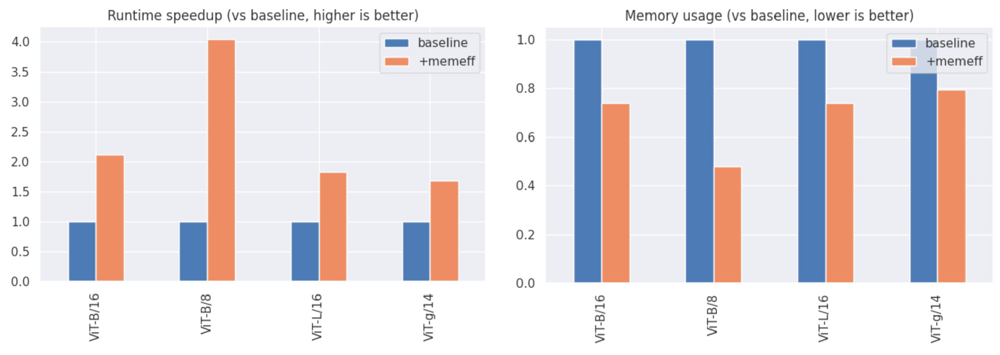
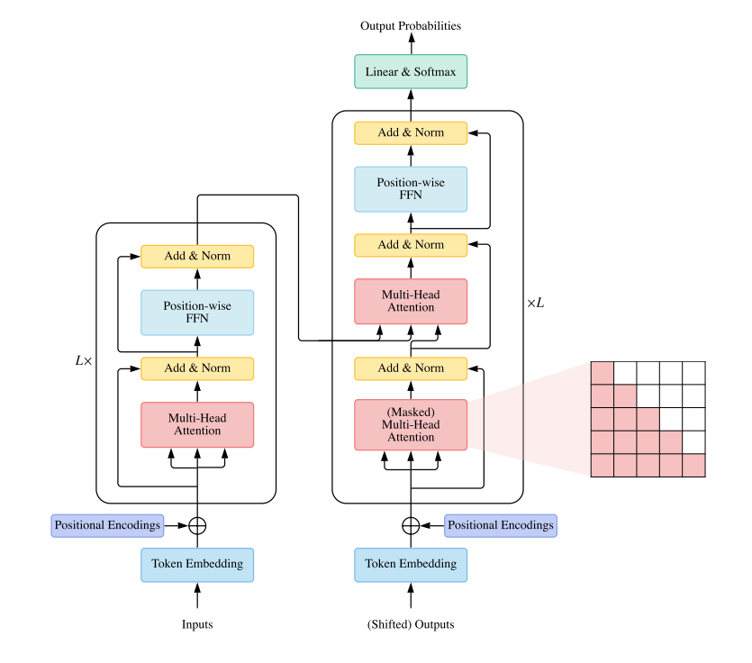

[](https://colab.research.google.com/github/facebookresearch/xformers/blob/main/docs/source/xformers_mingpt.ipynb)
<br/><!--


[](https://github.com/facebookresearch/xformers/actions/workflows/gh-pages.yml/badge.svg)
-->
[](https://app.circleci.com/pipelines/github/facebookresearch/xformers/)
[](https://codecov.io/gh/facebookresearch/xformers)
[](https://github.com/psf/black)
<br/>
[](CONTRIBUTING.md)
<!--
[](https://pepy.tech/project/xformers)
-->
--------------------------------------------------------------------------------

## xFormers - Toolbox to Accelerate Research on Transformers

xFormers is:
- **Customizable building blocks**: Independent/customizable building blocks that can be used without boilerplate code. The components are domain-agnostic and xFormers is used by researchers in vision, NLP and more.
- **Research first**: xFormers contains bleeding-edge components, that are not yet available in mainstream libraries like PyTorch.
- **Built with efficiency in mind**: Because speed of iteration matters, components are as fast and memory-efficient as possible. xFormers contains its own CUDA kernels, but dispatches to other libraries when relevant.

## Installing xFormers

* **(RECOMMENDED, linux) Install latest stable with conda**: Requires [PyTorch 2.3.1 installed with conda](https://pytorch.org/get-started/locally/)

```bash
conda install xformers -c xformers
```

* **(RECOMMENDED, linux & win) Install latest stable with pip**: Requires [PyTorch 2.3.1](https://pytorch.org/get-started/locally/)

```bash
# cuda 11.8 version
pip3 install -U xformers --index-url https://download.pytorch.org/whl/cu118
# cuda 12.1 version
pip3 install -U xformers --index-url https://download.pytorch.org/whl/cu121
```

* **Development binaries**:

```bash
# Use either conda or pip, same requirements as for the stable version above
conda install xformers -c xformers/label/dev
pip install --pre -U xformers
```

* **Install from source**: If you want to use with another version of PyTorch for instance (including nightly-releases)

```bash
# (Optional) Makes the build much faster
pip install ninja
# Set TORCH_CUDA_ARCH_LIST if running and building on different GPU types
pip install -v -U git+https://github.com/facebookresearch/xformers.git@main#egg=xformers
# (this can take dozens of minutes)
```


## Benchmarks

**Memory-efficient MHA**

*Setup: A100 on f16, measured total time for a forward+backward pass*

Note that this is exact attention, not an approximation, just by calling [`xformers.ops.memory_efficient_attention`](https://facebookresearch.github.io/xformers/components/ops.html#xformers.ops.memory_efficient_attention)

**More benchmarks**

xFormers provides many components, and more benchmarks are available in [BENCHMARKS.md](BENCHMARKS.md).

### (Optional) Testing the installation

This command will provide information on an xFormers installation, and what kernels are built/available:

```python
python -m xformers.info
```

## Using xFormers

### Transformers key concepts

Let's start from a classical overview of the Transformer architecture (illustration from Lin et al,, "A Survey of Transformers")
<p align="center">
  
</p>

You'll find the key repository boundaries in this illustration: a Transformer is generally made of a collection of attention mechanisms, embeddings to encode some positional information, feed-forward blocks and a residual path (typically referred to as pre- or post- layer norm). These boundaries do not work for all models, but we found in practice that given some accommodations it could capture most of the state of the art.

Models are thus not implemented in monolithic files, which are typically complicated to handle and modify. Most of the concepts present in the above illustration correspond to an abstraction level, and when variants are present for a given sub-block it should always be possible to select any of them. You can focus on a given encapsulation level and modify it as needed.


### Repo map

```bash
├── ops                         # Functional operators
    └ ...
├── components                  # Parts zoo, any of which can be used directly
│   ├── attention
│   │    └ ...                  # all the supported attentions
│   ├── feedforward             #
│   │    └ ...                  # all the supported feedforwards
│   ├── positional_embedding    #
│   │    └ ...                  # all the supported positional embeddings
│   ├── activations.py          #
│   └── multi_head_dispatch.py  # (optional) multihead wrap
|
├── benchmarks
│     └ ...                     # A lot of benchmarks that you can use to test some parts
└── triton
      └ ...                     # (optional) all the triton parts, requires triton + CUDA gpu
```

<details><summary> Attention mechanisms</summary><p>

- [Scaled dot product](xformers/components/attention/scaled_dot_product.py)
  - *[Attention is all you need, Vaswani et al., 2017](https://arxiv.org/abs/1706.03762)*
- [Sparse](xformers/components/attention/scaled_dot_product.py)
  - whenever a sparse enough mask is passed
- [BlockSparse](xformers/components/attention/blocksparse.py)
  - *courtesy of [Triton](www.triton-lang.org)*
- [Linformer](xformers/components/attention/linformer.py)
  - *[Linformer, self-attention with linear complexity, Wang et al., 2020](https://arxiv.org/abs/2006.04768)*
- [Nystrom](xformers/components/attention/nystrom.py)
  - *[Nyströmformer: A Nyström-Based Algorithm for Approximating Self-Attention, Xiong et al., 2021](https://arxiv.org/abs/2102.03902)*
- [Local](xformers/components/attention/local.py).
 Notably used in (and many others)
  - *[Longformer: The Long-Document Transformer, Beltagy et al., 2020](https://arxiv.org/abs/2004.05150)*
  - *[BigBird, Transformer for longer sequences, Zaheer et al., 2020](https://arxiv.org/abs/2007.14062)*

- [Favor/Performer](xformers/components/attention/favor.py)
  - *[Rethinking Attention with Performers, Choromanski et al., 2020](https://arxiv.org/abs/2009.14794v1)*
- [Orthoformer](xformers/components/attention/ortho.py)
  - *[Keeping Your Eye on the Ball: Trajectory Attention in Video Transformers,
Patrick et al., 2021](https://arxiv.org/abs/2106.05392)*
- [Random](xformers/components/attention/random.py)
  - See BigBird, Longformers,..
- [Global](xformers/components/attention/global_tokens.py)
  - See BigBird, Longformers,..
- [FourierMix](xformers/components/attention/fourier_mix.py)
  - *[FNet: Mixing Tokens with Fourier Transforms, Lee-Thorp et al.](https://arxiv.org/abs/2105.03824v1)*
- [CompositionalAttention](xformers/components/attention/compositional.py)
  - *[Compositional Attention: Disentangling search and retrieval, S. Mittal et al.](https://arxiv.org/pdf/2110.09419v1.pdf)*
- [2D Pooling](xformers/components/attention/pooling.py)
  - *[Metaformer is actually what you need for vision, Yu et al.](https://arxiv.org/pdf/2111.11418v1.pdf)*

- [Visual Attention](xformers/components/attention/visual.py)
  - *[`Visual Attention Network`_, Guo et al](https://arxiv.org/pdf/2202.09741.pdf)*

- ... add a new one [see Contribution.md](CONTRIBUTING.md)

</p></details>

<details><summary>Feed forward mechanisms </summary><p>

- [MLP](xformers/components/feedforward/mlp.py)
- [Fused](xformers/components/feedforward/fused_mlp.py)
- [Mixture of Experts](xformers/components/feedforward/mixture_of_experts.py)
- [Conv2DFeedforward](xformers/components/feedforward/conv_mlp.py)

</p></details>

<details><summary>Positional embedding </summary><p>

- [Sine](xformers/components/positional_embedding/sine.py)
- [Vocabulary](xformers/components/positional_embedding/vocab.py)
- [Rotary](xformers/components/positional_embedding/rotary.py)
- [Simplicial](xformers/components/simplicial_embedding.py)

</p></details>

<details><summary>Residual paths </summary><p>

- [Pre](https://arxiv.org/pdf/2002.04745v1.pdf)
- [Post](https://arxiv.org/pdf/2002.04745v1.pdf)
- [DeepNorm](https://arxiv.org/pdf/2203.00555v1.pdf)

</p></details>

<details><summary>Initializations </summary><p>
  This is completely optional, and will only occur when generating full models through xFormers, not when picking parts individually.

  There are basically two initialization mechanisms exposed, but the user is free to initialize weights as he/she sees fit after the fact.
  - Parts can expose a `init_weights()` method, which define sane defaults
  - xFormers supports [specific init schemes](xformers/factory/weight_init.py) which *can take precedence* over the init_weights()

  If the second code path is being used (construct model through the model factory), we check that all the weights have been initialized, and possibly error out if it's not the case
  (if you set `xformers.factory.weight_init.__assert_if_not_initialized = True`)

  Supported initialization schemes are:
  - [Small init](https://arxiv.org/abs/1910.05895)
  - [Timm defaults](https://github.com/rwightman/pytorch-image-models/blob/master/timm/models/vision_transformer.py)
  - [ViT defaults](https://github.com/google-research/vision_transformer)
  - [Moco v3 defaults](https://github.com/facebookresearch/moco-v3)

  One way to specify the init scheme is to set the `config.weight_init` field to the matching enum value.
  This could easily be extended, feel free to submit a PR !

</p></details>

### Key Features

1. Many attention mechanisms, interchangeables
2. Optimized building blocks, beyond PyTorch primitives
   1. Memory-efficient exact attention - up to 10x faster
   2. sparse attention
   3. block-sparse attention
   4. fused softmax
   5. fused linear layer
   6. fused layer norm
   7. fused dropout(activation(x+bias))
   8. fused SwiGLU
3. Benchmarking and testing tools
   1. [micro benchmarks](BENCHMARKS.md)
   2. transformer block benchmark
   3. [LRA](xformers/benchmarks/LRA/README.md), with SLURM support
4. Programmatic and sweep friendly layer and model construction
   1. Compatible with hierarchical Transformers, like Swin or Metaformer
5. Hackable
   1. Not using monolithic CUDA kernels, composable building blocks
   2. Using [Triton](https://triton-lang.org/) for some optimized parts, explicit, pythonic and user-accessible
   3. Native support for SquaredReLU (on top of ReLU, LeakyReLU, GeLU, ..), extensible activations

### Install troubleshooting


* NVCC and the current CUDA runtime match. Depending on your setup, you may be able to change the CUDA runtime with `module unload cuda; module load cuda/xx.x`, possibly also `nvcc`
* the version of GCC that you're using matches the current NVCC capabilities
* the `TORCH_CUDA_ARCH_LIST` env variable is set to the architectures that you want to support. A suggested setup (slow to build but comprehensive) is `export TORCH_CUDA_ARCH_LIST="6.0;6.1;6.2;7.0;7.2;7.5;8.0;8.6"`
* If the build from source OOMs, it's possible to reduce the parallelism of ninja with `MAX_JOBS` (eg `MAX_JOBS=2`)
* If you encounter [`UnsatisfiableError`](https://github.com/facebookresearch/xformers/issues/390#issuecomment-1315020700) when installing with conda, make sure you have PyTorch installed in your conda environment, and that your setup (PyTorch version, cuda version, python version, OS) match [an existing binary for xFormers](https://anaconda.org/xformers/xformers/files)


### License

xFormers has a BSD-style license, as found in the [LICENSE](LICENSE) file.

## Citing xFormers

If you use xFormers in your publication, please cite it by using the following BibTeX entry.

``` bibtex
@Misc{xFormers2022,
  author =       {Benjamin Lefaudeux and Francisco Massa and Diana Liskovich and Wenhan Xiong and Vittorio Caggiano and Sean Naren and Min Xu and Jieru Hu and Marta Tintore and Susan Zhang and Patrick Labatut and Daniel Haziza and Luca Wehrstedt and Jeremy Reizenstein and Grigory Sizov},
  title =        {xFormers: A modular and hackable Transformer modelling library},
  howpublished = {\url{https://github.com/facebookresearch/xformers}},
  year =         {2022}
}
```

## Credits

The following repositories are used in xFormers, either in close to original form or as an inspiration:

* [Sputnik](https://github.com/google-research/sputnik)
* [GE-SpMM](https://github.com/hgyhungry/ge-spmm)
* [Triton](https://github.com/openai/triton)
* [LucidRain Reformer](https://github.com/lucidrains/reformer-pytorch)
* [RevTorch](https://github.com/RobinBruegger/RevTorch)
* [Nystromformer](https://github.com/mlpen/Nystromformer)
* [FairScale](https://github.com/facebookresearch/fairscale/)
* [Pytorch Image Models](https://github.com/rwightman/pytorch-image-models)
* [CUTLASS](https://github.com/nvidia/cutlass)
* [Flash-Attention](https://github.com/HazyResearch/flash-attention)
