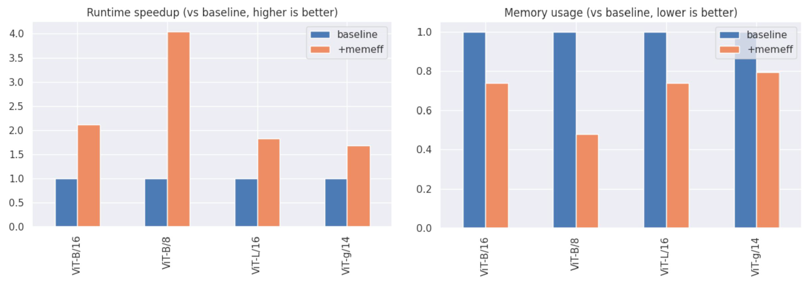

<p align="center">
  <a href="README.md">English</a> · <b>简体中文</b>
</p>


[](https://colab.research.google.com/github/facebookresearch/xformers/blob/main/docs/source/xformers_mingpt.ipynb)
<br/><!--


[](https://github.com/facebookresearch/xformers/actions/workflows/gh-pages.yml/badge.svg)
-->
[](https://app.circleci.com/pipelines/github/facebookresearch/xformers/)
[](https://codecov.io/gh/facebookresearch/xformers)
[](https://github.com/psf/black)
<br/>
[](CONTRIBUTING.md)
<!--
[](https://pepy.tech/project/xformers)
-->
--------------------------------------------------------------------------------

## xFormers - 加速 Transformer 研究的工具箱

xFormers 具备以下核心特性：
- **高度可定制的构建组件**：独立且高度可定制的底层组件，无需冗余样板代码即可直接调用。各组件与特定领域解耦，广泛应用于计算机视觉（Vision）、自然语言处理（NLP）等多模态前沿研究。
- **研究优先（Research First）**：xFormers 包含诸多前沿顶尖算子与组件，许多在 PyTorch 等主流库中尚未提供。
- **专为极致效率构建**：算法迭代速度至关重要，因此组件兼顾极致的速度与显存效率。xFormers 实现了专有的高性能 CUDA 内核，并在适当时自动分发调度至其他高性能计算库。

## 安装指南

* **(强烈推荐，Linux 与 Windows) 通过 pip 安装最新稳定版**: 需要 [PyTorch 2.10.0](https://pytorch.org/get-started/locally/)

```bash
# [linux & win] cuda 12.6 版本
pip3 install -U xformers --index-url https://download.pytorch.org/whl/cu126
# [linux & win] cuda 12.8 版本
pip3 install -U xformers --index-url https://download.pytorch.org/whl/cu128
# [linux & win] cuda 13.0 版本
pip3 install -U xformers --index-url https://download.pytorch.org/whl/cu130
# [仅限 linux] (实验性支持) rocm 7.1 版本
pip3 install -U xformers --index-url https://download.pytorch.org/whl/rocm7.1
```

* **开发版预构建轮子 (Development binaries)**:

```bash
# 依赖要求与上述稳定版相同
pip install --pre -U xformers
```

* **从源码安装 (Install from source)**: 例如希望配合其他特定版本的 PyTorch（包括 nightly 版本）使用时：

```bash
# (可选) 安装 ninja 以大幅提升编译速度
pip install ninja
# 如果在不同类型的 GPU 机器上编译与运行，请设置 TORCH_CUDA_ARCH_LIST
# 注意：必须预先安装 PyTorch！
pip install -v --no-build-isolation -U git+https://github.com/facebookresearch/xformers.git@main#egg=xformers
# (源码编译可能需要几十分钟)
```


## 基准性能评测

**内存高效注意力（Memory-efficient MHA）**

*评测环境：A100 GPU，FP16 精度，测量前向传播 + 反向传播的总耗时*

请注意，这属于精确注意力计算（Exact Attention）而非近似计算，仅需调用 [`xformers.ops.memory_efficient_attention`](https://facebookresearch.github.io/xformers/components/ops.html#xformers.ops.memory_efficient_attention) 即可轻松实现。

**更多基准评测**

xFormers 提供了丰富的算子与组件，更多基准测试数据请参阅 [BENCHMARKS.md](BENCHMARKS.md)。

### (可选) 验证安装

此命令可打印当前 xFormers 安装环境信息，以及已编译/可用的底层算子内核：

```python
python -m xformers.info
```

## 使用 xFormers

### 核心特性

1. 超越 PyTorch 原生算子的深度优化组件：
   1. 高效内存精确注意力（Memory-efficient exact attention）—— 速度最高提升 10 倍
   2. 稀疏注意力（Sparse attention）
   3. 块稀疏注意力（Block-sparse attention）
   4. 融合 Softmax（Fused softmax）
   5. 融合线性层（Fused linear layer）
   6. 融合层归一化（Fused layer norm）
   7. 融合 Dropout 与激活函数（Fused dropout(activation(x+bias))）
   8. 融合 SwiGLU 激活（Fused SwiGLU）

### 安装故障排查

* 确保 NVCC 版本与当前 CUDA 运行时匹配。根据系统环境，可尝试通过 `module unload cuda; module load cuda/xx.x` 切换 CUDA 版本，可能还需要对应调整 `nvcc`。
* 确保使用的 GCC 编译器版本与当前 NVCC 兼容。
* 环境变量 `TORCH_CUDA_ARCH_LIST` 已设置为希望支持的 GPU 架构。推荐设置（构建耗时较长但兼容全面）：`export TORCH_CUDA_ARCH_LIST="6.0;6.1;6.2;7.0;7.2;7.5;8.0;8.6"`。
* 若从源码编译时发生内存不足（OOM），可通过 `MAX_JOBS` 限制 Ninja 的并行编译进程数（例如 `MAX_JOBS=2`）。
* 在 Windows 上若遇到 `Filename longer than 260 characters`（路径超过 260 字符）报错，请确认操作系统已开启长路径支持，并执行命令 `git config --global core.longpaths true`。

### 开源许可证

xFormers 采用 BSD 风格开源许可证，详见 [LICENSE](LICENSE) 文件。
本项目包含了来自 [triton-lang/kernels](https://github.com/triton-lang/kernels) 仓库的部分代码。

## 引用 xFormers

如果您在学术发表中使用了 xFormers，请使用以下 BibTeX 格式进行引用：

``` bibtex
@Misc{xFormers2022,
  author =       {Benjamin Lefaudeux and Francisco Massa and Diana Liskovich and Wenhan Xiong and Vittorio Caggiano and Sean Naren and Min Xu and Jieru Hu and Marta Tintore and Susan Zhang and Patrick Labatut and Daniel Haziza and Luca Wehrstedt and Jeremy Reizenstein and Grigory Sizov},
  title =        {xFormers: A modular and hackable Transformer modelling library},
  howpublished = {\url{https://github.com/facebookresearch/xformers}},
  year =         {2022}
}
```

## 致谢与参考

以下开源项目直接应用于 xFormers 中，或作为其核心灵感来源：

* [Sputnik](https://github.com/google-research/sputnik)
* [GE-SpMM](https://github.com/hgyhungry/ge-spmm)
* [Triton](https://github.com/openai/triton)
* [LucidRain Reformer](https://github.com/lucidrains/reformer-pytorch)
* [RevTorch](https://github.com/RobinBruegger/RevTorch)
* [Nystromformer](https://github.com/mlpen/Nystromformer)
* [FairScale](https://github.com/facebookresearch/fairscale/)
* [Pytorch Image Models](https://github.com/rwightman/pytorch-image-models)
* [CUTLASS](https://github.com/nvidia/cutlass)
* [Flash-Attention](https://github.com/HazyResearch/flash-attention)

---

> 💡 **文档维护说明**：本中文文档由社区志愿者（[@JasonYeYuhe](https://github.com/JasonYeYuhe)）翻译维护，最后同步更新于 2026年09月29日。如发现内容与官方英文原版存在差异或新特性滞后，欢迎提交 PR 共同完善！
