Using Triton-based layers
=========================

Triton_ is a language and compiler for parallel programming, currently applicable to CUDA-enabled GPUs.
It is compatible with PyTorch CUDA Tensors, and can be interfaced directly with pure python code.

PyTorch provides many primitives capable of tranforming tensors, which correspond to operators in each of the supported backends.
There are limits to how many of them can be supported at any point in time, short of supporting a JIT toolchain,
so some operations typical of the Transformer family are supported in PyTorch as a sequence of base operators.

Triton makes it possible to consolidate some of them into ad-hoc fused operators, which are compiled just-in-time.
xFormers proposes a couple of optimized layers, and the goal is to increase their number over time.

Fused softmax layer
-------------------

This is a drop-in replacement to `torch.nn.softmax`_, the only limitation being that the softmax operation is limited to the last dimension.
Log-softmax is also available. The actual Triton kernel is very similar to `this tutorial<https://triton-lang.org/getting-started/tutorials/02-fused-softmax.html#sphx-glr-getting-started-tutorials-02-fused-softmax-py>`

.. code-block:: python

    from xformers.triton import softmax, log_softmax
    y = softmax(x)   # Torch AMP, autograd aware

The expected throughput, when compared to PyTorch and on a nVidia V100, is along these lines

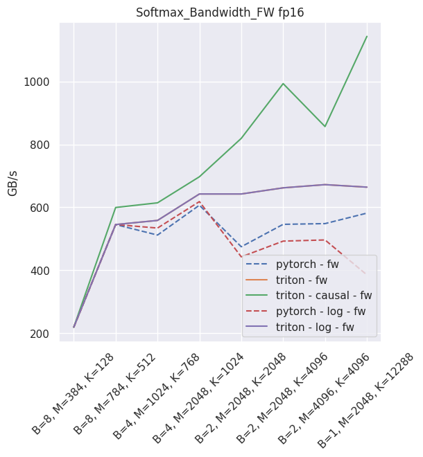

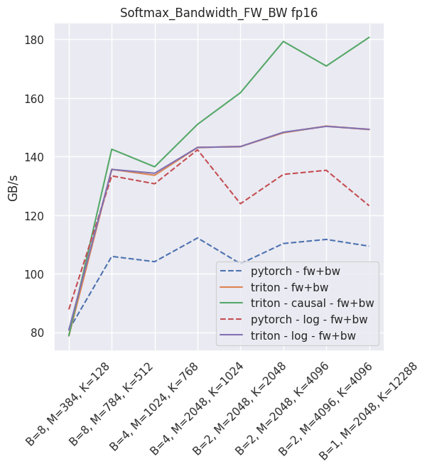

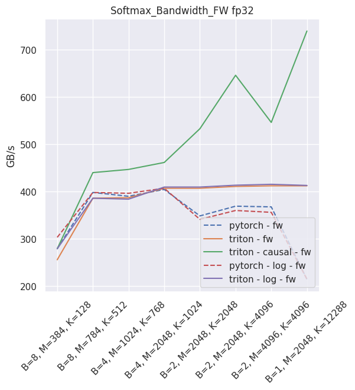

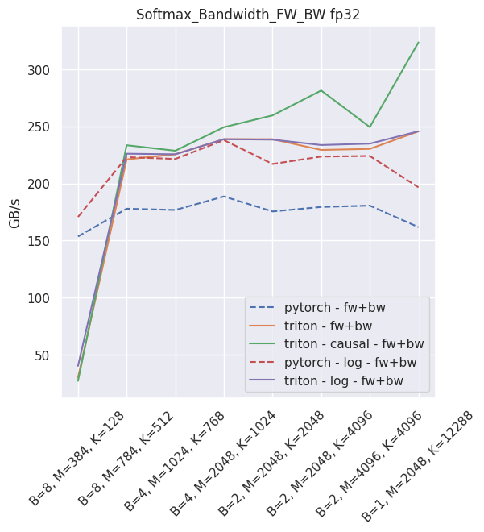

Fused linear layer
-------------------
This is a drop-in replacement to two PyTorch operands: a `torch.nn.Linear`, and an activation, like `torch.nn.ReLU`. It is Torch AMP and autograd aware, and can be used very simply:

.. code-block:: python

    from xformers.triton import FusedLinearLayer

    my_linear_layer = FusedLinearLayer(in_features, out_features, bias=True/False, activation="squared_relu")

    ...

    y = my_linear_layer(x)

It is possible to skip either the bias or the activation (just use `None` in that case). As of September 2021, this layer is **faster than PyTorch for non-sigmoid activations and fp16**.
In all other usecases, you will be better served using PyTorch.

The following is an example of the measured performance on a laptop nVidia 3080, using Triton 1.1 and PyTorch 1.10.

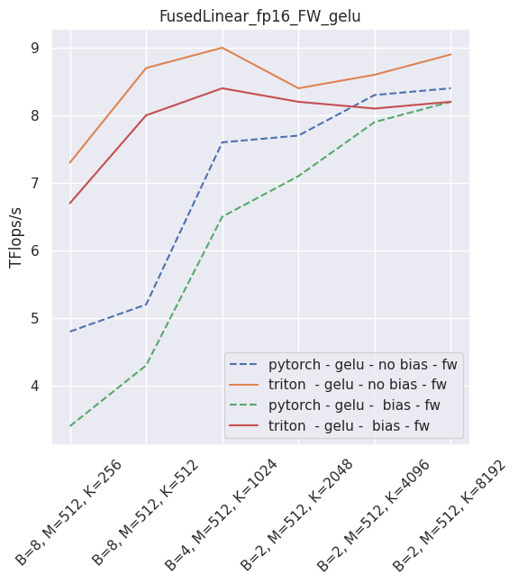

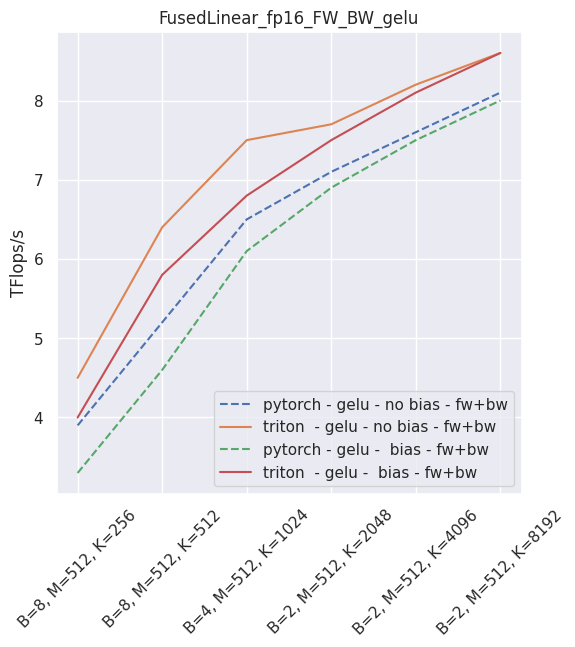

--

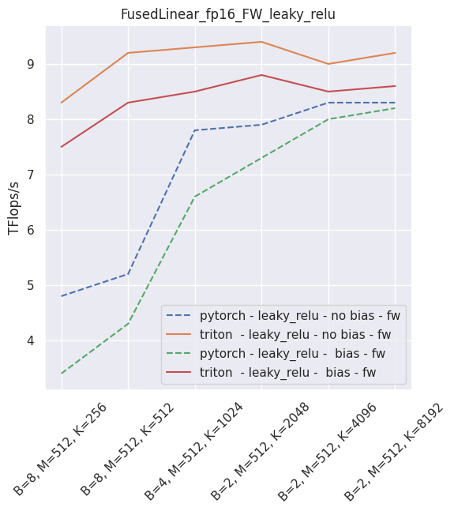

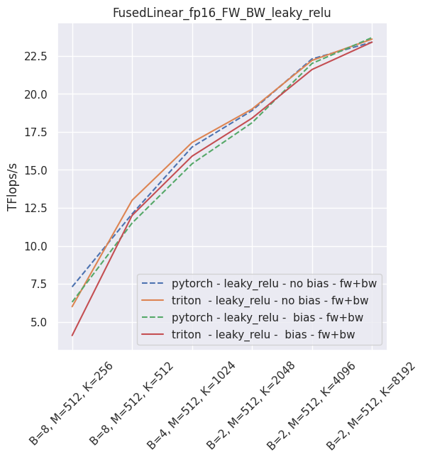

--

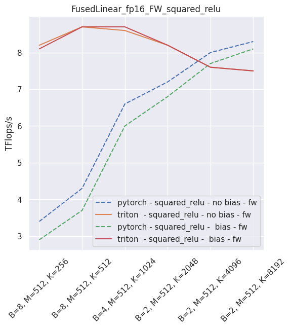

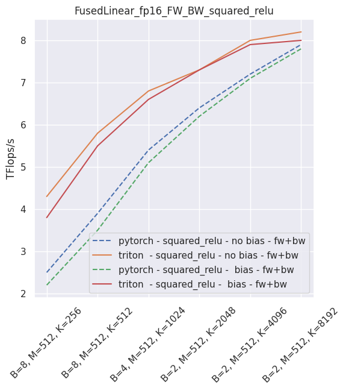

--

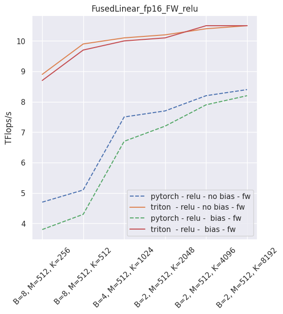

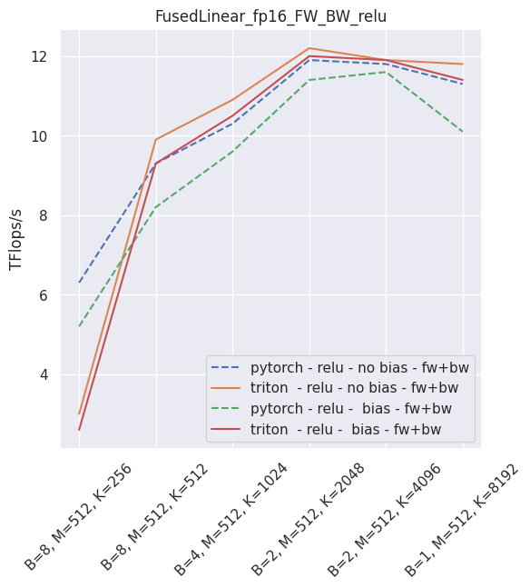

Fused layer norm
-----------------

You can reproduce these numbers locally by running `python3 xformers/benchmarks/benchmark_triton_layernorm.py`. The units are GB/s. These results are for a laptop nVidia 3080, Triton 1.1 and PyTorch 1.10.

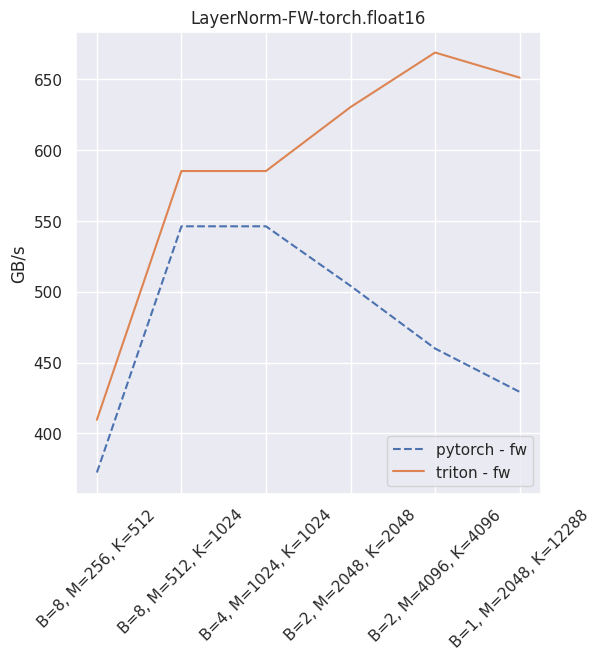

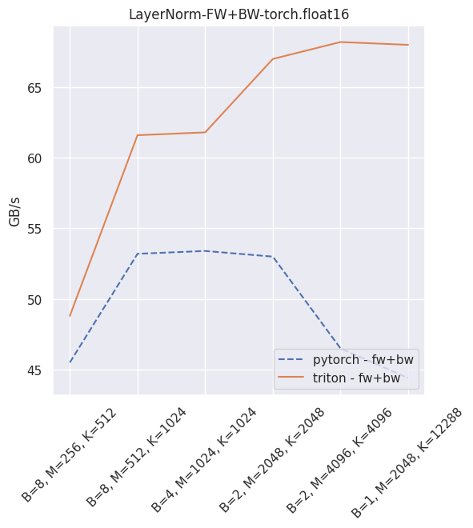

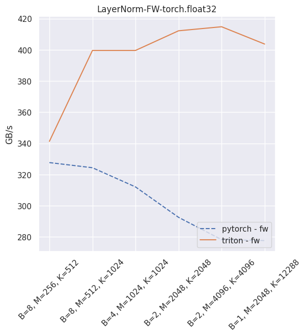

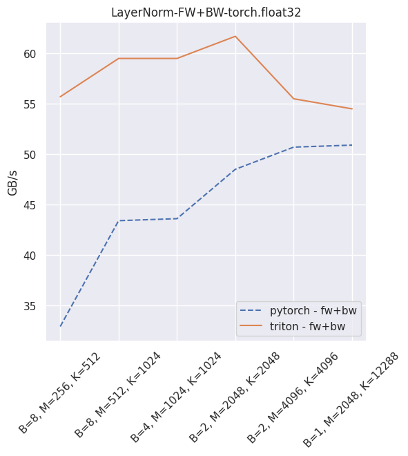

Fused dropout + bias + activation
---------------------------------

You can reproduce these numbers locally by running `python3 xformers/benchmarks/benchmark_triton_dropout.py`. The units are GB/s.
These results are for a laptop nVidia 3080, Triton 1.1 and PyTorch 1.10.

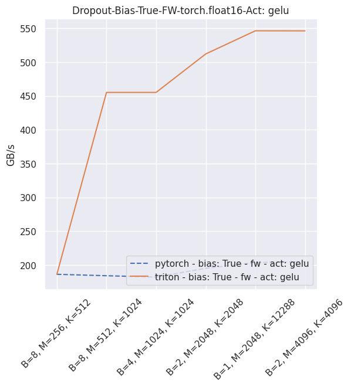

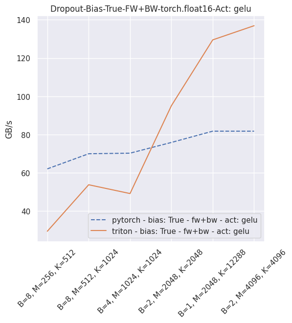

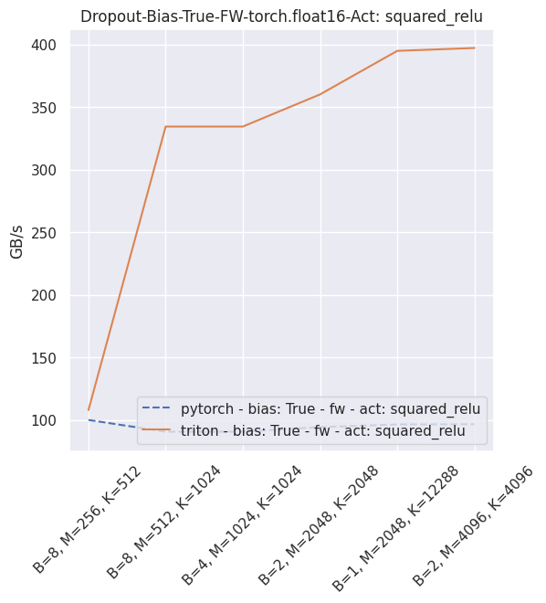

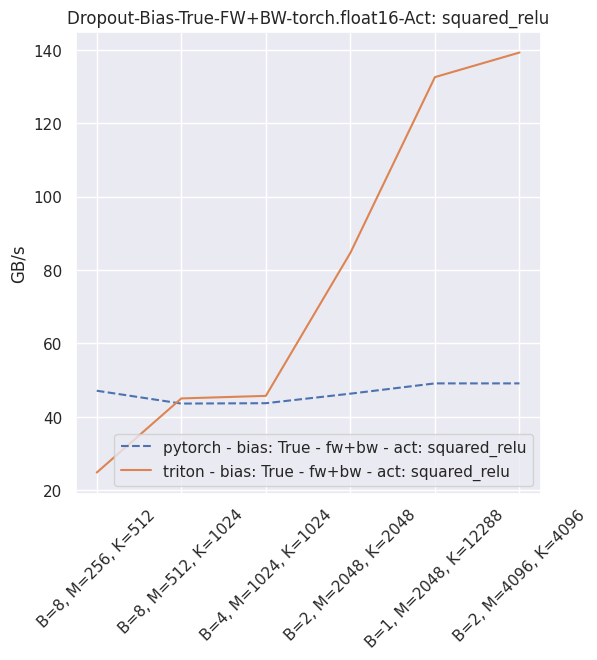

.. _Triton: https://triton-lang.org/
.. _`torch.nn.softmax`: https://pytorch.org/docs/stable/generated/torch.nn.Softmax.html
