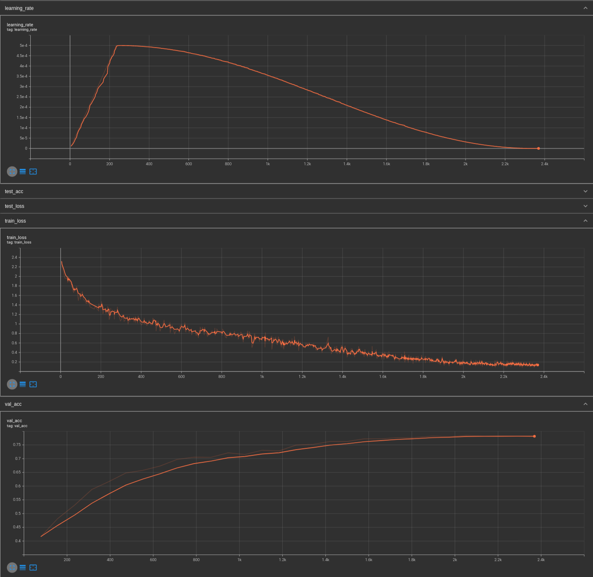
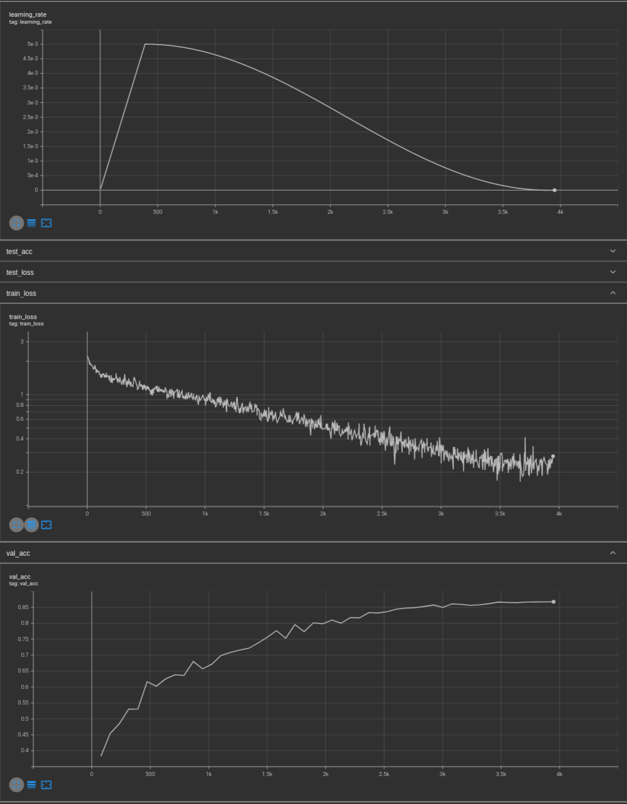

# Examples

You can find in this folder a couple of ready to use examples, which include dataset, training loop and modelling through xFormers.
They are purposedly very simple, using what are nowadays toy datasets and small enough models to be trained on Colab or on a personal computer,
but they could easily be extended.

These examples are meant to illustrate some possible usecases for xFormers, but certainly not all of them.
In particular several of them use the `factory`, which is an optional interface to delegate the whole Transformer construction to xFormers.

In the future we'll also show how existing reference models (from [Pytorch image models](https://github.com/rwightman/pytorch-image-models) or Torchvision for instance)
can be patched with parts from xFormers which extent their capabilities.

## HOW TO

Please install the dependencies (`pip install -r requirements.txt`), after that all the examples can be run directly
(for instance `python3 microViT.py`). You should see a dataset being downloaded the first time, then training and the current loss,
and finally an inference example or some test loss and accuracy.

If your current machine does not expose enough RAM and the example reports an `OutOfMemoryError`, please adjust the batch size.

## NLP

### microGPT

This is an hommage to [minGPT](https://github.com/karpathy/minGPT), in particular the training over Shakespeare dialogs of an autoregressive model. The default configuration is that of a standard Transformer, but you can change parts as you see fit. You can get to reasonable results within an hour or so on a single GPU.

### Llama inference

This example showcases how to use xformers kernels and cuda graphs to generate efficiently from large language models.
See [the README](llama_inference/README.md) for details on how to run it.

## Vision models

You can find a couple of very small examples, of models being trained on the CIFAR10 dataset. They can be modified to training on something like ImageNet with minimal changes, but running them out of the box requires a bit more work in that case.

### ViT

This is meant to be an easy introduction to using xformers in practice, mirroring closely [this Pytorch Lightning](https://pytorchlightning.github.io/lightning-tutorials/notebooks/lightning_examples/cifar10-baseline.html) tutorial. The default settings are close to this tutorial, which trains a 11M parameters ResNet on the CIFAR dataset, we train a 10.6M ViT on the same dataset. The ViT configuration is not optimal for CIFAR, since the pictures have a very small size to begin with and information is probably lost given the patches. Nevertheless you should be able to reach about 80% accuracy within about an hour on a single GPU.

### Metaformer

This is very close to the MicroViT example above, but illustrating the use of a hierarchical Transformer ([Metaformer](https://arxiv.org/pdf/2111.11418.pdf)) this time, through a helper function which generates the required configuration given the pooling parameters. The suggested configuration is about 6.6M parameters big (half of a ResNet18) and trains to about 86% top-1 Cifar10 within minutes.

